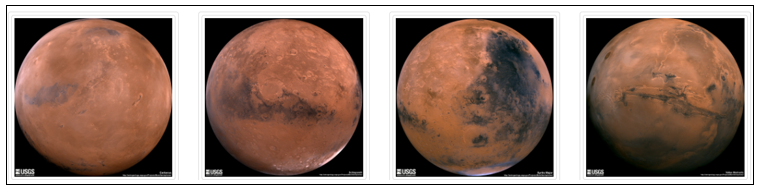

# Mission-to-Mars
*Web-scraping with HTML and CSS*

## Project Overview

In this project I am performing web scraping from active **Nasa’s** websites in order to retrieve information about Nasa’s latest article, featured picture, Mars facts and images of Mars Hemispheres. All retrieved data are put together in a single web application to showcase the gathered information.

For this project I am using: 

-	**Chrome Developer Tool** to identify HTML and CSS components.
-	**Beautiful Soup** (extracts data) and **Splinter** (automates web browsers) to automate the scrape [jupyter notebook](Mars_Scraping/Mission_to_Mars_Challenge.ipynb).
-	**Python** to write the script [scraping.py](Mars_Scraping/scraping.py).
-	**MongoDB**, a NoSQL database to store data. MongoDB can handle the data that isn’t structured, data without relationships to other data. Instead Mongo uses a document model which means that data is stored in JSON data structures.
-	**Flask** to render the data and create a web application [app.py](Mars_Scraping/app.py).
-	**HTML**, **CSS** and **Bootstrap 3** to customize web application [index.html](Mars_Scraping/templates/index.html).

  

## Resources

Data Source:
-	https://mars.nasa.gov/news/
-	https://www.jpl.nasa.gov/spaceimages/?search=&category=Mars
-	https://astrogeology.usgs.gov/search/results?q=hemisphere+enhanced&k1=target&v1=Mars

Environment: 
- Python 3.7

Dependencies: 
- Beautiful Soup and Splinter 

Languages: 
- HTML, CSS, Bootstrap 3 and Python

Software: 
- Jupyter Notebook, VS Code, MongoDB, Flask and Chrome

